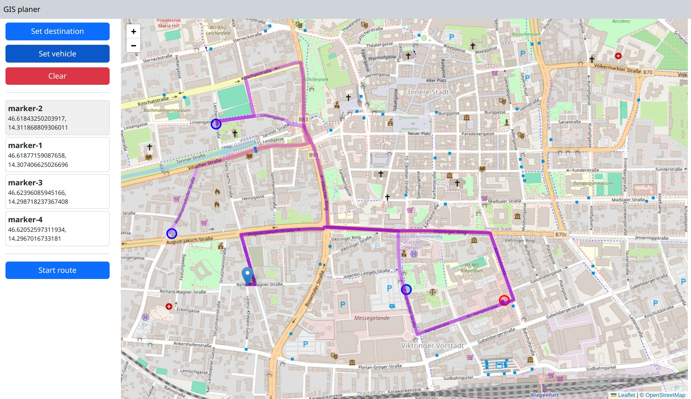
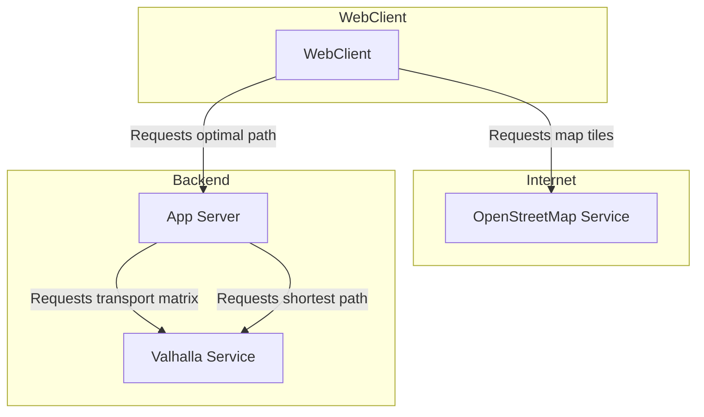

# Transport scheduling planer and router

The goal of this project is to experiment with leaflet, google or-tools and valhalla routing. 
The project is a web application that allows to plan transport schedules and routes for a fleet of vehicles. 
The application is based on the [leaflet](https://leafletjs.com/) library for the map and the [valhalla](https://github.com/valhalla/valhalla)
service for the routing. The [postgis](https://postgis.net/) geodb is created but currently not used.

The application tries to find the optimal route between a vehicle and its destination by solving a traveling salesman problem.

First select the destination points (blue circles):


By clicking on the left marker list the corresponding marker is selected.

After setting the vehicle start point the route can be calculated, by clicking on the `Start route` button.



# Setup and Tools
## create a virtualenviroment

```bash
python3 -m venv venv
source venv/bin/activate
pip install -r requirements.txt
```
Invoke is used as task runner. See [invoke](https://www.pyinvoke.org/)
```bash
pip install invoke
source <(inv --print-completion-script zsh)
```

# Backend services

The backend consists of a [postgis](https://postgis.net/) geodb and a [valhalla router](https://github.com/valhalla/valhalla) service. Both are started with docker-compose.
First the geodata needs to be downloaded and clipped to the area of interest. The data is stored in the `data` folder of the `docker`folder.
The geodata is downloaded from [geofabrik](https://www.geofabrik.de)  and clipped with the `osmconvert` tool. The clipped data is stored in the `data` folder of the `docker` folder.

```bash
inv docker-backend.download
inv docker-backend.clip
```

Use the invoke task `docker-backend` to start the services.

```bash
inv docker-backend.start
```

The services can be tested via the `docker-backend.test` task.

```bash
inv docker-backend.test
```

To stop the backend services use the `docker-backend.stop` task.

```bash
inv docker-backend.stop
```
# Valhalla router

The valhalla router docker image has a bug in the distance matrix generation. It is possible that some entries are `None` instead of
a correct value. the `docker/data/routing/valhalla.json` file has to be set to `"source_to_target_algorithm": "timedistancematrix"` (after the first start when it is generated)

# Architecture

The following shows the architecture of the application. The web client requests map tiles from the OpenStreetMap service and optimal paths from the App Server. The App Server 
requests the transport matrix. This transport matrix is used to solve the traveling salesman problem
and the shortest path from the Valhalla Service.

